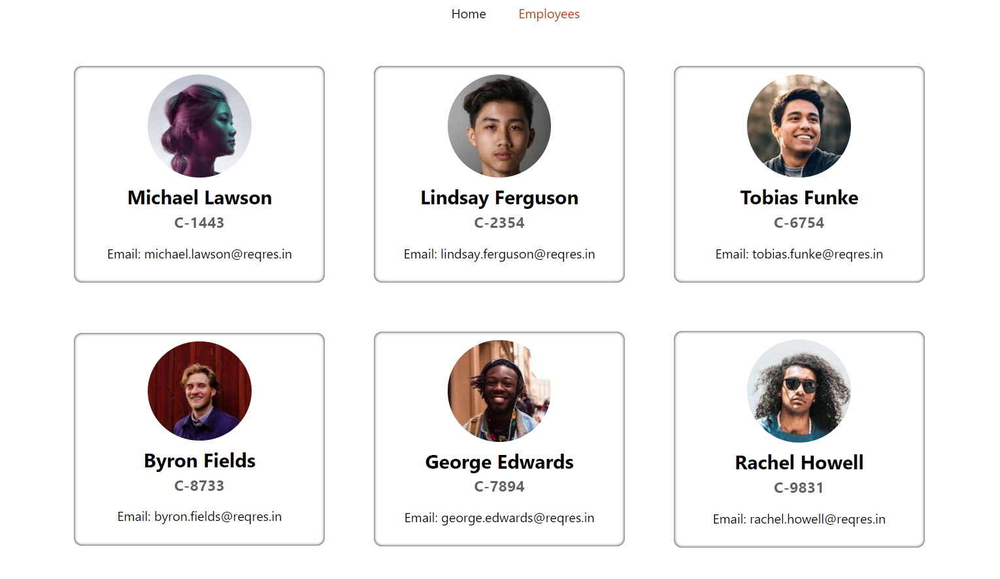
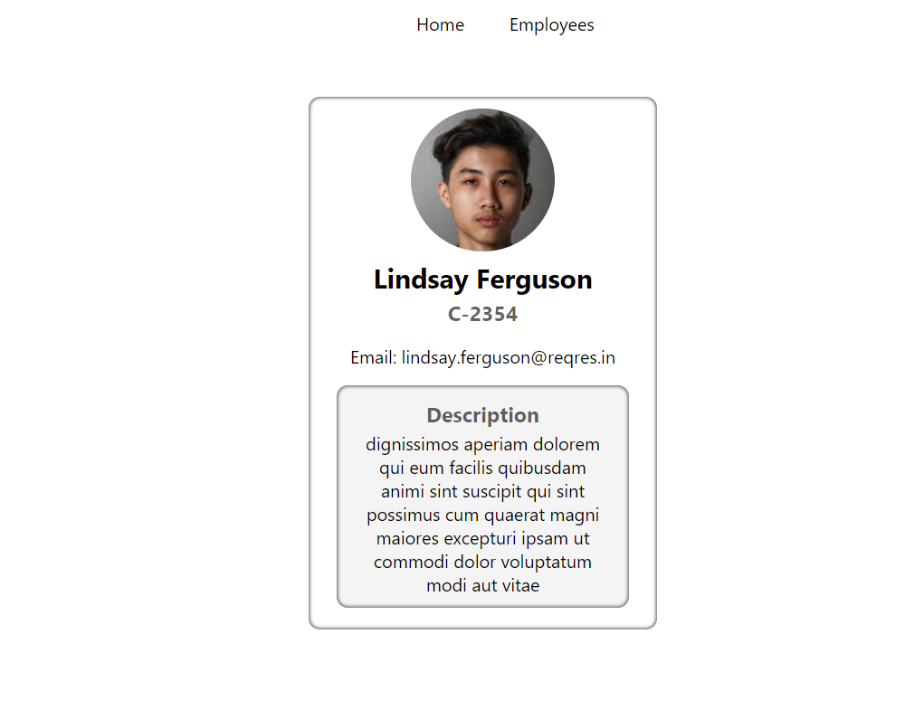

# Employee Manager React App

This a small Web App For _Only For Practice Purpose_

### App scren shot

### You will Learn 

* React Basics
* Reach Accessing Thes Server Throught Https /Ajax
* Fecth data and Upload Data to the Realtime Database Using Free Realtime Databe (FireBase Google) [FireBase](https://firebase.google.com/)
* Learn to use install, Send Request Get, Post [Axios](https://www.npmjs.com/package/axios)
* React Routing Using  [React Router](https://reactrouter.com/)
* Nested Routing
### App scren shot

### Requirement 
* Basic Knowlende of React
* Text editor example: [VSCODE] (https://code.visualstudio.com/) 
* Basic Terminal Knowledge
* Json Basic Knowledge

### Json File with Data Provided

There is Jason file with data in _ReadmeInfo/EmployeeData.json_ provide you will have to upload it 
to the FireBase Realtime database
